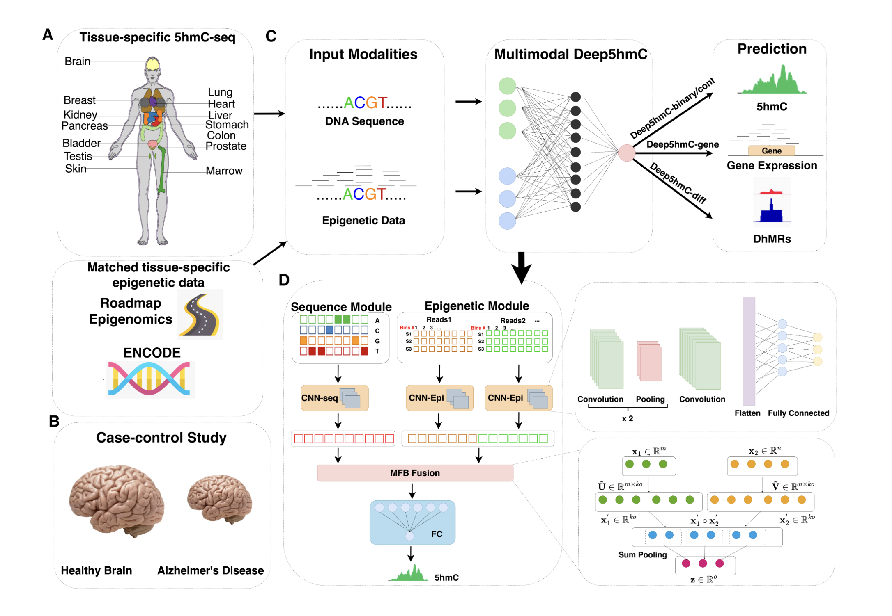

# Deep5hmC: Predicting genome-wide 5-Hydroxymethylcytosine landscape via multimodal deep learning model

We develop __Deep5hmC__, which is a multimodal deep learning framework that integrates both the DNA sequence and the epigenetic features, to predict genome-wide 5hmC modification. Moreover, __Deep5hmC__ demonstrates its practical usage by accurately predicting gene expression and differentially hydroxymethylated regions in a case-control Alzheimer’s disease study.

<br/>




## Installation

1. Download __Deep5hmC__:
```bash
git clone https://github.com/XinBiostats/Deep5hmC
```
2. Requirements: __Deep5hmC__ is implemented in Python. To install requirements
```bash
conda env create -f environment.yml
```
## Usage
1. Download preprocessed "Forebrain Orgainoid" data at EB stage from [Dropbox](https://www.dropbox.com/scl/fo/zbht290yp67yfd1bcvofy/AGG8rFnKJxGTbmrv6uR_RSA?rlkey=3va94r26om8muivxho72wpzpp&dl=0) to './Deep5hmC/data'.
2. Setup "./source/config.json" file.
```json
{
  "data_path": "../data",           // Path to the directory where the data is stored
  "weights_path": "../weights",     // Path to the directory where model weights will be saved
  "prediction_path": "../prediction", // Path to the directory where prediction results will be saved
  
  "model_types": ["binary", "continuous"], // Types of models to use
  "tissue": "EB",                   // Type of tissue being analyzed, in this case, 'EB' (Embryoid Body)
  "histones": ["H3K4me1", "H3K4me3"], // List of histone modifications to be considered in the analysis
  
  "batch_size": 512,                // Number of samples per batch during training
  "lr": 1e-3,                       // Learning rate for training the model
  "num_epochs": 5,                  // Number of training epochs
  "earlystop_thresh": 10            // Number of epochs to wait for improvement before early stopping is triggered
}
```
### In terminal
3. Activate your conda environment 'Deep5hmC' in the terminal.
```bash
conda activate Deep5hmC
```
4. Create .h5 data.
```bash
cd ./source

python create_h5.py config.json
```
5. Run Deep5hmC-binary or Deep5hmC-cont model.
```bash
python Deep5hmC_binary.py config.json

python Deep5hmC_cont.py config.json
```

### In Jupyter
We created a demo ([demo.ipynb](https://github.com/XinBiostats/Deep5hmC/blob/main/source/demo.ipynb)) to demonstrate how to use __Deep5hmC__. The results will be displayed inline or saved by users.

# Citation
([__Ma X__, Thela SR, Zhao F, Yao B, Wen Z, Jin P, Zhao J, Chen L. Deep5hmC: Predicting genome-wide 5-Hydroxymethylcytosine landscape via a multimodal deep learning model. bioRxiv [Preprint]. 2024 Mar 6:2024.03.04.583444. doi: 10.1101/2024.03.04.583444. PMID: 38496575; PMCID: PMC10942288.](https://www.biorxiv.org/content/10.1101/2024.03.04.583444v1))
